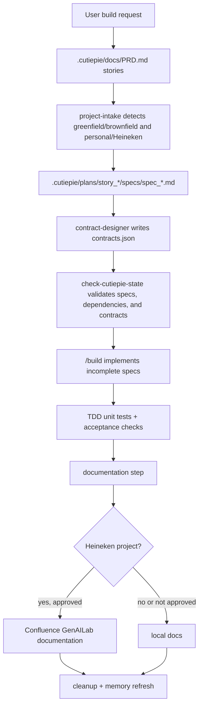

# Cutiepie Architecture

## Components

| Component | Responsibility | Inputs | Outputs |
| --- | --- | --- | --- |
| `project-intake` | Detect greenfield/brownfield and personal/Heineken context. | Repo files, git remote, user confirmation. | Scaffold choice, repo review, Heineken setup tasks. |
| `prd-discovery` | Convert the user's idea into PRD stories. | User prompt and repo context. | `.cutiepie/docs/PRD.md`. |
| `story-planner` | Create story-local implementation plans and draft specs. | PRD stories, architecture, config, repo review. | `.cutiepie/plans/story_*/plan.md`, `ADR.md`, and `specs/spec_*.md`. |
| `contract-designer` | Design story contracts after specs are drafted. | Story specs. | `contracts.json` and patched spec contract references. |
| `check-cutiepie-state.sh` | Mechanically validate story state. | `.cutiepie/docs/*`, `.cutiepie/plans/story_*/*`. | State report and exit code. |
| `build` | Implement incomplete specs. | Valid story state, specs, contracts, codebase. | Code changes, tests, acceptance check updates, completed specs. |
| `documentation` | Produce local or Heineken docs. | PRD, specs, contracts, architecture, research, decisions. | Local docs or approved Confluence page draft/publish. |
| `cleanup` | Remove stale/orphaned state and refresh memory. | Git diff, story state, generated files. | Clean state report, refreshed memory/preamble. |

## Diagram Guidance

- Use a high-level dataflow or layer diagram for most projects.
- Add C4 L1/L2 only when external actors/services or deployable containers need explicit boundaries.
- Add sequence diagrams only for the most important flows.
- Prefer draw.io-compatible XML or Mermaid source for durable architecture docs.
