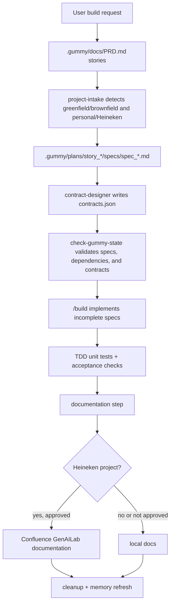
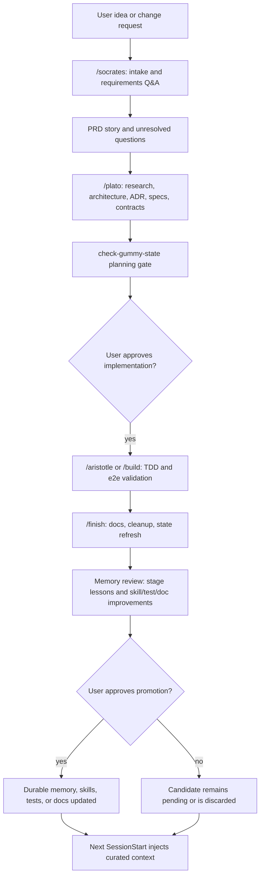

# Gummy Architecture

## Components

| Component | Responsibility | Inputs | Outputs |
| --- | --- | --- | --- |
| `project-intake` | Detect greenfield/brownfield and personal/Heineken context. | Repo files, git remote, user confirmation. | Scaffold choice, repo review, Heineken setup tasks. |
| `prd-discovery` | Convert the user's idea into PRD stories. | User prompt and repo context. | `.gummy/docs/PRD.md`. |
| `story-planner` | Create story-local ADRs and draft specs. | PRD stories, architecture, config, repo review. | `.gummy/plans/story_*/ADR.md` and `specs/spec_*.md`. |
| `contract-designer` | Design story contracts after specs are drafted. | Story specs. | `contracts.json` and patched spec contract references. |
| `check-gummy-state.sh` | Mechanically validate story state. | `.gummy/docs/*`, `.gummy/plans/story_*/*`. | State report and exit code. |
| `/socrates` | Gather requirements and unresolved decisions. | User request, repo state, existing Gummy state. | PRD stories and open questions. |
| `/plato` | Research and design consequential choices. | PRD stories, repo context, current public evidence when needed. | ADR decisions, specs, contracts, architecture updates. |
| `/aristotle` | Implement with empirical validation. | Approved story state, specs, contracts, codebase. | Code changes, tests, acceptance check updates, completed specs. |
| `/finish` | Close out a session. | Implemented specs, git diff, docs, state checker output. | Documentation, cleanup, state audit, memory candidates. |
| `memory-review` | Promote only approved learning. | `CANDIDATES.jsonl`, user approval, verification command. | Durable memory/failure entries or explicit manual patch tasks. |
| `build` | Compatibility entrypoint for implementing incomplete specs. | Valid story state, specs, contracts, codebase. | Code changes, tests, acceptance check updates, completed specs. |
| `documentation` | Produce local or Heineken docs. | PRD, specs, contracts, architecture, research, decisions. | Local docs or approved Confluence page draft/publish. |
| `cleanup` | Remove stale/orphaned state and refresh memory. | Git diff, story state, generated files. | Clean state report, refreshed memory/preamble. |

## Target Workflow: Story 006

Story 006 keeps the current story-scoped state model but makes the user-facing flow easier to remember:

| Phase | Command Intent | Primary Artifact Owners |
| --- | --- | --- |
| Socrates | Ask only unresolved questions and capture requirements. | `PRD.md` plus story open questions. |
| Plato | Research current options and design the solution. | Story `ADR.md`, specs, and `contracts.json`. |
| Aristotle | Prove behavior with tests and acceptance checks. | Tests, Playwright/e2e evidence, spec `passes`, and spec `completed`. |
| Finish | Document, clean, refresh state, and stage learning. | Docs, cleanup report, memory candidates, and preamble. |

## Diagram Guidance

- Use a high-level dataflow or layer diagram for most projects.
- Add C4 L1/L2 only when external actors/services or deployable containers need explicit boundaries.
- Add sequence diagrams only for the most important flows.
- Prefer draw.io-compatible XML or Mermaid source for durable architecture docs.
