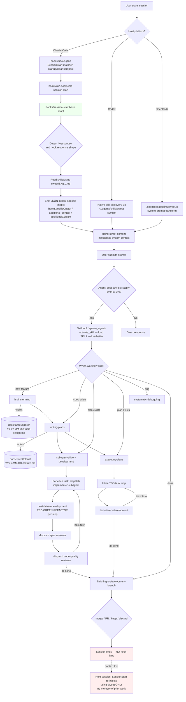

# Customising the Sweet Fork into a Personal Cross-Harness SWE Harness

## Context

This fork (`mattoh91/sweet`) descends from `mattoh91/sweet`. Goal: turn it into a personal SWE harness that runs on both Claude Code and Codex, while:

1. Severing upstream contributor pressure (the inherited `CLAUDE.md` is anti-slop guidance for PRs *to* `mattoh91/sweet` — irrelevant here, actively misdirects agents working on the fork).
2. Rebranding manifests so installs don't collide with upstream.
3. Reshaping the spec/plan artifact format to a structured AGILE-style multi-doc layout: `PRD.md` (product/biz, conventional) + `FRD.md` + `ARD.md` + `CAVEATS.md` + `ARCHI.md` + `CONFIG.md` as the spec set, plus a separate implementation `PLAN.md`.
4. Two-tier testing: unit TDD stays as the implementer discipline (machine-internal), while each feature has an automated feature acceptance gate and each touched component has an automated component contract gate backed by one or more functional checks.
5. Adding context-aware requirements probing (sample data, edge cases, analogous-tool feature lists) to brainstorming.
6. Adding failure-mode capture, memory persistence (out-of-tree, per-user, under `~/.sweet/memory/<project>/`), and a session-bootstrap `/preamble` skill that *generates a copy-paste string* (not auto-writes).
7. Adding a project scaffolding skill (init.sh, Makefile, CI baseline) that emits the spec/plan file skeleton.

The fork targets Claude Code and Codex. Claude Code packaging uses `.claude-plugin/`, `commands/`, `agents/`, and `hooks/`. Codex packaging uses `.codex-plugin/` with shared `skills/`, `.agents/plugins/marketplace.json` for local marketplace installation, and `.codex/hooks.json` for Codex hook adapters. The portable layer is `skills/` (markdown). Host lifecycle behavior lives in `hooks/`; skills provide explicit fallbacks when a host hook is unavailable or disabled.

### Resolved decisions

- **Doc mapping:** `PRD.md` = product/biz requirements (conventional). `FRD.md` + `ARD.md` + `CAVEATS.md` + `ARCHI.md` + `CONFIG.md` + `PRD.md` collectively = the spec set. `PLAN.md` = the implementation plan (feature-by-feature and component-by-component, with TDD nested inside each component). By default these files live under `.sweet/` or `docs/sweet/`; root-level output is a scaffold option for new app repos that want visible project-management files.
- **Test layering:** Two-tier. Unit TDD inside (RED-GREEN-REFACTOR, machine-internal). Each feature has an automated feature acceptance gate for the user/system outcome. Each touched component has an automated component contract gate for DTO/data-contract shape, schema behavior, adapter payloads, public API behavior, or equivalent boundary verification.
- **Agentic engineering guidelines:** `docs/sweet/AGENTIC_ENGINEERING_GUIDELINES.md` is the shared meta-contract for feature progress, component contracts, closed verification loops, YAGNI/KISS/DRY/SOLID, surgical changes, commit hygiene, memory updates, and subagent handoffs.
- **Memory location:** Per-user, out of tree, at `~/.sweet/memory/<project-slug>/{MEMORY.md,FAILURES.md,SESSIONS/}`. Never committed. The `<project-slug>` is derived from the repo's git remote or directory name.
- **`/preamble` shape:** Pure generator — runs in any session, reads memory + git logs + open `PLAN.md` tasks + FRD progress, prints a context block to stdout. User copy-pastes into the next fresh session. No `CLAUDE.md` mutation.

---

## 1. The Sweet Agentic Flow (current state)

**Key observations driving customization:**

- Only **one** hook is registered (`SessionStart`). No `PreCompact`, `SessionEnd`, `Stop`, `UserPromptSubmit`, `PreToolUse`, `PostToolUse` — so painpoints 3 & 4 (failure capture, memory continuity) have no current scaffolding to hook into.
- Specs are a **single merged `design.md`**. No FRD/ARD/CAVEATS/ARCHI split.
- Plans are **TDD-step-granular** (each task = "write failing test / verify fail / minimal code / verify pass / commit"), which exposes too much unit-test machinery as the visible progress unit.
- `test-driven-development/SKILL.md` is **strictly unit-level**; component/integration/functional tests are mentioned in code-review checklists but never enforced as a tier.
- No requirements-probing for sample data or analogous-tool feature audits in `brainstorming`.
- No project scaffolding (init.sh, Makefile, CI). Only `tests/subagent-driven-dev/svelte-todo/scaffold.sh` for internal test fixtures.
- `commands/*.md` (brainstorm, write-plan, execute-plan) are all stubs marked "deprecated — use the skill instead."

---

## 2. Painpoints → Treatment

| # | Painpoint | Treatment | Existing surface to modify | New surface to add |
|---|-----------|-----------|----------------------------|--------------------|
| 1 | Spec doc structure (PRD/FRD/ARD/CAVEATS/ARCHI), feature-level acceptance, and component-level contracts, not unit-test review | UPDATE `brainstorming` to emit 5 separate spec files with mermaid C4 + sequence diagrams; UPDATE `writing-plans` to organize work by feature and component, with feature acceptance gates and component contract gates; KEEP TDD as nested implementer discipline | `skills/brainstorming/SKILL.md`, `skills/writing-plans/SKILL.md`, `skills/test-driven-development/SKILL.md` (add Sweet gate tier reference), `skills/requesting-code-review/SKILL.md` (review against feature/component gates) | `skills/component-functional-testing/SKILL.md` (defines acceptable automated forms: (a) data-shape-at-boundary contract, (b) automated e2e/user-flow scenario via Playwright/browser/computer-use/API scenario tooling where applicable) |
| 2 | Context-aware requirements gathering (sample data, edge cases, analogous-tool features) | UPDATE `brainstorming` to add a probing phase that requests sample inputs/scenarios and runs analogous-tool web research when available; if network/tools are unavailable, ask the user for comparable tools, sample data, docs, screenshots, exports, or realistic scenarios and audit against those local/user-provided materials | `skills/brainstorming/SKILL.md` (add probe-and-audit step) | Optional: `skills/probing-requirements/SKILL.md` if the probe step is heavy enough to warrant a sub-skill |
| 3 | Failure-mode documentation & self-improvement | NEW skill for agent-facing failure-mode summarization; NEW hook scripts that persist structured state. Hooks run shell scripts; they do not invoke markdown skills directly. Agents invoke the skill explicitly when curated memory is needed | `hooks/hooks.json`, `.codex/hooks.json` | `skills/capturing-failure-modes/SKILL.md`, `hooks/pre-compact`, `hooks/session-end`, `hooks/codex-stop`, out-of-tree artifact `~/.sweet/memory/<project>/FAILURES.md` |
| 4 | Memory for fresh sessions | UPDATE `hooks/session-start` to auto-load recent state from `~/.sweet/memory/<project>/` on hook-capable hosts; UPDATE `finishing-a-development-branch` to write memory and update FRD progress; NEW `/preamble` slash command + skill that prints a copy-paste context block | `hooks/session-start`, `skills/finishing-a-development-branch/SKILL.md` | `skills/preamble/SKILL.md` (+ `commands/preamble.md` slash command where supported), `hooks/session-end`, `hooks/pre-compact`, out-of-tree artifacts under `~/.sweet/memory/<project>/`: `MEMORY.md`, `FAILURES.md`, `SESSIONS/<YYYY-MM-DD>.md` |
| 5 | Wasted time scaffolding repo | NEW skill that emits a standardized repo skeleton (`init.sh`, `Makefile`, CI baseline, the PRD/FRD/ARD/CAVEATS/ARCHI/PLAN file set) | none | `skills/scaffolding-repo/SKILL.md` (+ template tree under `skills/scaffolding-repo/template/`), optional `commands/scaffold.md` slash command |

---

## 3. Resolved Artifact Contract

**In-repo (committed) — produced by the harness, reviewed as project artifacts:**

- `.sweet/PRD.md` or `docs/sweet/PRD.md` — product/biz requirements. The "what" and "why." Lists features/capabilities that map to FRD entries.
- `.sweet/FRD.md` or `docs/sweet/FRD.md` — functional requirements per feature, feature-to-component map, automated feature acceptance gates, component contract gates, and progress.
- `.sweet/ARD.md` or `docs/sweet/ARD.md` — architecture decision record. One section per significant decision (problem, options, decision, consequences).
- `.sweet/CAVEATS.md` or `docs/sweet/CAVEATS.md` — assumptions, dependencies, known unknowns, environmental constraints.
- `.sweet/ARCHI.md` or `docs/sweet/ARCHI.md` — mermaid diagrams: C4 L1 (system context), C4 L2 (containers), and per-component sequence diagrams.
- `.sweet/CONFIG.md` or `docs/sweet/CONFIG.md` — settings/config owner and documented hyperparameters/tunables: model names, temperatures, token limits, thresholds, retry counts, timeouts, polling intervals, batch sizes, feature flags, and similar values.
- `.sweet/PLAN.md` or `docs/sweet/PLAN.md` — implementation plan, organized by feature and component. Each feature lists its acceptance gate; each component lists its contract gate and implementer-internal TDD step blocks. Replaces the date-prefixed `docs/sweet/plans/YYYY-MM-DD-feature.md` for Sweet-managed projects.

Root-level `PRD.md`, `FRD.md`, `ARD.md`, `CAVEATS.md`, `ARCHI.md`, `CONFIG.md`, and `PLAN.md` are allowed as an explicit scaffold option for new app repos, but they are not the default inside this harness repo because they collide with repo-maintenance plans.

**Out-of-tree (per-user, never committed) — at `~/.sweet/memory/<project-slug>/`:**

- `MEMORY.md` — design decisions taken during build, deviations from the plan, learnings about this project. Indexed list of pointers to detail files. Updated by `finishing-a-development-branch` after each component is signed off.
- `FAILURES.md` — repeated failure patterns / modes seen by the agent in this project. Updated by `capturing-failure-modes` (invoked via PreCompact/SessionEnd hooks on Claude Code, or directly by the agent on Codex).
- `SESSIONS/<YYYY-MM-DD>.md` — per-day session log per the strategic-compact pattern: start time, end time, what got done, what's next.

The `<project-slug>` resolution is git-remote-based (e.g. `github.com-mattoh91-sweet`) with directory-name fallback. The scaffolding-repo skill creates the `~/.sweet/memory/<project-slug>/` tree on first run.

---

## 4. Updates vs New Additions vs Displacements vs Switch-Offs

### Updates to existing components

- **`skills/brainstorming/SKILL.md`** — add (i) requirements-probing phase (sample data, edge cases, analogous-tool web research when available, local/user-provided fallback when not), (ii) emit `PRD.md` + `FRD.md` + `ARD.md` + `CAVEATS.md` + `ARCHI.md` + `CONFIG.md` multi-file output under `.sweet/` or `docs/sweet/` instead of single `design.md`, (iii) require mermaid C4 L1+L2 + sequence diagrams in `ARCHI.md`.
- **`skills/writing-plans/SKILL.md`** — re-frame plan as a list of features and components matching FRD entries, with feature acceptance gates, component contract gates, and TDD step-blocks nested inside as implementer-internal detail. Output to `.sweet/PLAN.md` or `docs/sweet/PLAN.md` by default instead of dated `docs/sweet/plans/`.
- **`skills/test-driven-development/SKILL.md`** — keep the RED-GREEN-REFACTOR core; add an explicit reference to `component-functional-testing` as the layer above unit TDD. Document that unit tests are implementer-internal, component contract gates are boundary-level, and feature acceptance gates are outcome-level.
- **`skills/requesting-code-review/SKILL.md`** + **`agents/code-reviewer.md`** — review must verify feature/component gates exist, run, and match the FRD; not just unit tests.
- **`skills/finishing-a-development-branch/SKILL.md`** — on completion, append to `~/.sweet/memory/<project>/MEMORY.md` (design decisions, deviations from plan), tick FRD feature/component progress in the in-repo `FRD.md`, suggest `clear`/`compact` per the strategic-compact pattern (referenced from affaan-m/everything-claude-code).
- **`hooks/session-start`** — extend the existing bash script to additionally read `~/.sweet/memory/<project>/{MEMORY.md,FAILURES.md}` (resolved via git remote → project slug), last N git commits, and open FRD features/components, then concat into the `additionalContext` JSON on hook-capable hosts.
- **`hooks/hooks.json`** — register `PreCompact` and `SessionEnd` event matchers for Claude Code.
- **`CLAUDE.md`** (root) — replace the upstream anti-slop contributor guide with fork-specific guidance ("this is a personal harness fork; upstream contribution rules do not apply locally; treat skills/hooks as live experimental ground").
- **`.claude-plugin/plugin.json`**, **`.codex-plugin/plugin.json`**, **`gemini-extension.json`**, **`.version-bump.json`** — rebrand `name`, `displayName`, `description`, `homepage`, `repository`, `author`. Suggest `sweet` as the fork name (the repo is already named `sweet`) so installs don't collide with upstream's `sweet`.
- **`README.md`**, **`RELEASE-NOTES.md`** — fork voice; remove upstream sponsorship/Discord links.
- **`scripts/sync-to-codex-plugin.sh:34`** (`FORK="prime-radiant-inc/openai-codex-plugins"`) — point to your downstream Codex repo, or remove if you don't intend to mirror.
- **`assets/`** — replace logos (low priority, can defer).

### New additions

- **`skills/component-functional-testing/SKILL.md`** — defines acceptable automated gate forms: feature acceptance gates for user/system outcomes; component contract gates for boundary data-shape contracts, schemas, adapter payloads, public API behavior, and equivalent harness automation. Cross-linked from `test-driven-development`, `writing-plans`, `requesting-code-review`.
- **`skills/probing-requirements/SKILL.md`** *(optional — could be folded into brainstorming, recommend separate skill so it's reusable)* — sample-data probing + analogous-tool research as a discrete step that brainstorming invokes. Uses web/docs tools when available; otherwise asks the user for comparable tools, sample data, screenshots, exports, existing docs, and realistic scenarios.
- **`skills/capturing-failure-modes/SKILL.md`** — agent-facing workflow for summarizing repeated patterns, root causes, and fixes. Hook scripts persist raw/structured session state; this skill turns that state into durable entries. Appends structured entries to `~/.sweet/memory/<project>/FAILURES.md`.
- **`skills/preamble/SKILL.md`** + **`commands/preamble.md`** — `/preamble` slash command that prints a copy-paste context block: reads `~/.sweet/memory/<project>/MEMORY.md` + `FAILURES.md` + `SESSIONS/` (last N), last K git commits, open FRD features/components, current PLAN.md tasks, and key DTO/schema/adapter references. Pure stdout — no file mutation.
- **`docs/sweet/AGENTIC_ENGINEERING_GUIDELINES.md`** — canonical engineering meta-contract referenced by repo-level instructions and skills.
- **`skills/scaffolding-repo/SKILL.md`** + **`skills/scaffolding-repo/template/`** — emits `init.sh`, `Makefile` (with `lint`, `typecheck`, `test`, `smoke`, `fmt` targets), CI baseline workflow (GitHub Actions by default), `.gitignore`, and the in-repo file skeletons under `.sweet/` or `docs/sweet/` by default: `PRD.md`, `FRD.md`, `ARD.md`, `CAVEATS.md`, `ARCHI.md`, `CONFIG.md`, `PLAN.md`. Also creates `~/.sweet/memory/<project>/{MEMORY.md,FAILURES.md,SESSIONS/}` on first run.
- **`hooks/pre-compact`** — bash script (polyglot like `session-start`) that persists current session state to `~/.sweet/memory/<project>/SESSIONS/<YYYY-MM-DD>.md` with a compaction marker. It cannot load a markdown skill directly.
- **`hooks/session-end`** — bash script that finalizes the daily session file (writes end-time + summary when available). It cannot inject new context into the just-ended session.
- **In-repo artifact skeletons (templated by `scaffolding-repo` skill):** `.sweet/PRD.md`, `.sweet/FRD.md`, `.sweet/ARD.md`, `.sweet/CAVEATS.md`, `.sweet/ARCHI.md`, `.sweet/CONFIG.md`, `.sweet/PLAN.md` or `docs/sweet/*` equivalents.
- **Out-of-tree artifact skeletons (also templated by `scaffolding-repo`):** `~/.sweet/memory/<project>/{MEMORY.md, FAILURES.md, SESSIONS/}`.

### Displacements (one-for-one swaps)

- Single `docs/sweet/specs/YYYY-MM-DD-topic-design.md` → active in-repo set under `.sweet/` or `docs/sweet/`: `PRD.md` + `FRD.md` + `ARD.md` + `CAVEATS.md` + `ARCHI.md` + `CONFIG.md` (per-project, not date-prefixed; live-edited as the project evolves).
- Single `docs/sweet/plans/YYYY-MM-DD-feature.md` (TDD-step granularity) → `.sweet/PLAN.md` or `docs/sweet/PLAN.md` (feature/component granularity matching FRD entries, with TDD step-blocks nested inside each component as implementer-internal detail).
- Review unit: TDD step → component contract gate pass plus feature acceptance gate pass when the feature is integrated.
- Memory implicit-in-context-window → explicit out-of-tree memory at `~/.sweet/memory/<project>/`.

### Switch-offs / removals

- **`commands/brainstorm.md`**, **`commands/write-plan.md`**, **`commands/execute-plan.md`** — already deprecated stubs. Remove or repurpose into the new `/preamble` and `/scaffold` commands.
- The upstream contributor guidance in `CLAUDE.md` — remove (replaced).
- The "PRs to mattoh91/sweet" workflow in `.github/PULL_REQUEST_TEMPLATE.md` — remove or rewrite for fork.
- `RELEASE-NOTES.md` upstream entries — keep as historical, but new entries are fork-scoped.

### What stays as-is

- `skills/using-sweet/`, `skills/using-git-worktrees/`, `skills/dispatching-parallel-agents/`, `skills/subagent-driven-development/`, `skills/executing-plans/`, `skills/systematic-debugging/`, `skills/verification-before-completion/`, `skills/writing-skills/`, `skills/receiving-code-review/`.
- The polyglot hook plumbing (`hooks/run-hook.cmd`, env-var detection in `session-start`).
- `scripts/bump-version.sh`, `scripts/sync-to-codex-plugin.sh` mechanism (only the FORK constant changes).
- Test harness layout in `tests/`.

### Cross-harness delivery boundaries

- **Shared across Claude Code and Codex:** `skills/`, agent-facing instructions, artifact formats, feature/component gate rules, guidelines, and memory file format under `~/.sweet/memory/<project>/`.
- **Claude Code:** `hooks/` and `commands/` provide lifecycle automation.
- **Codex:** packages shared `skills/` through `.codex-plugin/plugin.json` and uses `.codex/hooks.json` when `codex_hooks` is enabled. Skills remain the fallback path when hooks are unavailable.

---

## 5. Critical Files to Modify (paths)

- `/Users/OHM02/Repos/sweet/CLAUDE.md`
- `/Users/OHM02/Repos/sweet/skills/brainstorming/SKILL.md`
- `/Users/OHM02/Repos/sweet/skills/writing-plans/SKILL.md`
- `/Users/OHM02/Repos/sweet/skills/test-driven-development/SKILL.md`
- `/Users/OHM02/Repos/sweet/skills/finishing-a-development-branch/SKILL.md`
- `/Users/OHM02/Repos/sweet/skills/requesting-code-review/SKILL.md`
- `/Users/OHM02/Repos/sweet/agents/code-reviewer.md`
- `/Users/OHM02/Repos/sweet/hooks/hooks.json`
- `/Users/OHM02/Repos/sweet/hooks/session-start`
- `/Users/OHM02/Repos/sweet/.claude-plugin/plugin.json`
- `/Users/OHM02/Repos/sweet/.codex-plugin/plugin.json`
- `/Users/OHM02/Repos/sweet/gemini-extension.json`
- `/Users/OHM02/Repos/sweet/.version-bump.json`
- `/Users/OHM02/Repos/sweet/README.md`
- `/Users/OHM02/Repos/sweet/scripts/sync-to-codex-plugin.sh`

## 6. New Files to Create

- `skills/component-functional-testing/SKILL.md`
- `docs/sweet/AGENTIC_ENGINEERING_GUIDELINES.md`
- `skills/probing-requirements/SKILL.md` *(optional)*
- `skills/capturing-failure-modes/SKILL.md`
- `skills/preamble/SKILL.md`
- `skills/scaffolding-repo/SKILL.md` (+ `template/` subtree)
- `commands/preamble.md`, `commands/scaffold.md`
- `hooks/pre-compact`
- `hooks/session-end`

---

## 7. Suggested Phasing (small to large blast radius)

1. **Rebrand + sever upstream pressure** — replace `CLAUDE.md`, rename in all `plugin.json`/`gemini-extension.json`/`.version-bump.json`, update `README.md`, repoint `sync-to-codex-plugin.sh` `FORK`. Lowest risk, immediate effect.
2. **Add `scaffolding-repo` skill** — produces the in-repo PRD/FRD/ARD/CAVEATS/ARCHI/PLAN skeleton under `.sweet/` or `docs/sweet/` + init.sh/Makefile/CI templates, plus the out-of-tree `~/.sweet/memory/<project>/` tree. Independent of skill graph changes.
3. **Add `component-functional-testing` skill** + cross-link from `test-driven-development` and `requesting-code-review`; add shared agentic engineering guidelines. Pure addition.
4. **Refactor `brainstorming`** to emit 5-file specs (PRD/FRD/ARD/CAVEATS/ARCHI) and add probing step (sample data + analogous-tool web research when available, user/local-material fallback when not). Touches one skill but changes artifact contract.
5. **Refactor `writing-plans`** to feature/component granularity with nested TDD; output to `PLAN.md`. Depends on (4).
6. **Add `capturing-failure-modes` and `preamble` skills** + `pre-compact`, `session-end` hook scripts (Claude Code only). Hooks persist state; skills summarize and update durable memory.
7. **Update `finishing-a-development-branch`** to write MEMORY/FAILURES, tick FRD feature/component progress, suggest compact.
8. **Update `hooks/session-start`** to load MEMORY/FAILURES/recent commits/open FRD features/components.

Each phase ships independently; (4) and (5) are paired.

---

## 8. Verification

- **Existing test harness:** run `tests/claude-code/run-skill-tests.sh` after each phase. Tests under `tests/skill-triggering/` validate that updated skill descriptions still trigger correctly. `tests/codex-plugin-sync/test-sync-to-codex-plugin.sh` verifies the rebranded sync still produces a deterministic Codex plugin.
- **Skill quality:** use `sweet:writing-skills` for adversarial pressure-testing of every changed skill. Compare before/after triggering on the same prompts.
- **End-to-end on a real fork project:** create a fresh project, run `/scaffold` → brainstorm a small feature → verify 5 spec files written under `.sweet/` or `docs/sweet/` → verify PLAN.md is feature/component-granular → execute one component → verify component contract gate runs and unit TDD nests inside → integrate feature → verify feature acceptance gate runs → run `finishing-a-development-branch` → verify FRD feature/component status ticked + MEMORY appended → start a new session with `/preamble` and confirm context restores.
- **Hook lifecycle:** trigger compact in Claude Code, confirm `pre-compact` hook fires, FAILURES.md gets an entry, SESSIONS file is written. End session, confirm `session-end` finalizes the daily file. New session: confirm `session-start` hook injects MEMORY/FAILURES/git-log context.
- **Cross-harness sanity:** install in Claude Code AND Codex (via plugin or `~/.agents/skills/sweet` symlink). Verify SessionStart fires on Claude Code; verify Codex picks up skills via native discovery; verify Codex hooks fire when `codex_hooks` is enabled; verify the skill-side fallback for `capturing-failure-modes` works when hooks are unavailable.
- **Mermaid render:** open `ARCHI.md` in a markdown renderer (or GitHub) to confirm C4 L1/L2 and sequence diagrams display.
