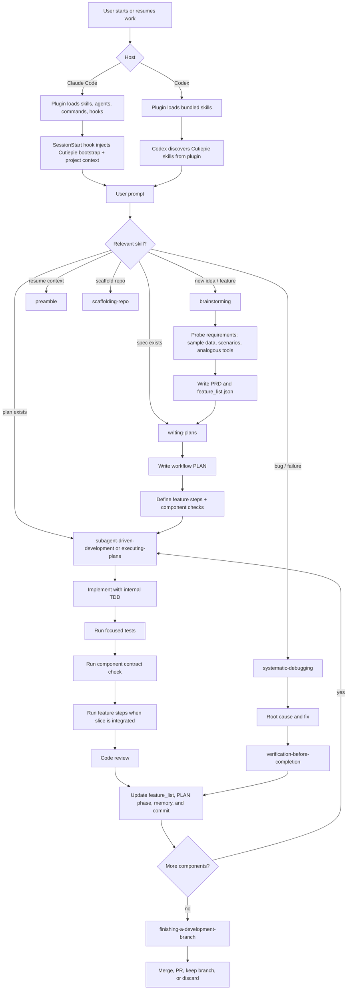
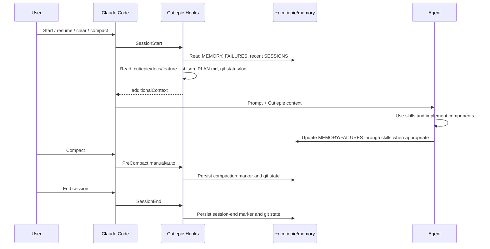

# Cutiepie

Cutiepie is an opinionated SWE harness for Claude Code and Codex. It packages reusable skills, canonical project artifacts, spec-driven feature checks, component contract checks, and memory conventions so agents can move from idea to implementation with less context loss and less unit-test micromanagement.

Cutiepie is built around two host surfaces:

- **Claude Code:** plugin manifest, skills, agents, slash commands, and lifecycle hooks.
- **Codex:** plugin manifest, local marketplace metadata, shared skills, and Codex lifecycle hooks when `hooks` is enabled.

## Core Contract

Cutiepie projects use these committed artifacts:

- `.cutiepie/docs/PRD.md` — problem statement, users, user stories, success criteria, and non-goals.
- `.cutiepie/docs/feature_list.json` — machine-readable feature specs, steps, citations, implementation phases, and `passes`.
- `.cutiepie/docs/ARD.md` — architecture decisions, assumptions, caveats, options, and consequences.
- `.cutiepie/docs/ARCHI.md` — draw.io dataflow diagram plus component/interface notes.
- `.cutiepie/docs/CONFIG.md` — environment variables, settings owners, hyperparameters, and tunables.
- `.cutiepie/docs/PLAN.md` — human workflow checklist and phase-level progress.
- `docs/cutiepie/AGENTIC_ENGINEERING_GUIDELINES.md` — shared engineering contract for feature progress, component contracts, verification loops, commits, memory, and subagent handoffs.

`feature_list.json` owns individual feature completion. `PLAN.md` must not duplicate feature pass/fail state.

Runtime memory is per-user and out of tree:

```text
~/.cutiepie/memory/<project-slug>/
├── MEMORY.md
├── FAILURES.md
└── SESSIONS/
```

## Agentic Loop

For a browser-friendly explanation with a clickable SVG map, open `docs/cutiepie/cutiepie.html`.



## Hook Lifecycle

Cutiepie has host-specific hook adapters. Claude Code and Codex both support lifecycle hooks, but the event names and configuration locations differ.



Current hook files:

- `hooks/session-start` — injects Cutiepie bootstrap, memory, recent sessions, canonical docs, state-contract report, and git state.
- `hooks/pre-compact` — records compaction marker, raw hook payload, branch, and git status.
- `hooks/session-end` — records session-end marker, raw hook payload, branch, and git status.
- `hooks/codex-stop` — records Codex turn-stop markers, raw hook payload, branch, and git status.
- `hooks/update-state` — writes a static Cutiepie state audit and mechanical next-session preamble under `~/.cutiepie/memory/<project-slug>/`.

Host configuration:

- Claude Code reads `.claude-plugin/plugin.json` and `hooks/hooks.json`.
- Codex reads hooks from active config layers such as `.codex/hooks.json` or `~/.codex/hooks.json`. Project-local Codex hooks require the `.codex/` layer to be trusted.

Codex hooks are behind a feature flag:

```toml
[features]
hooks = true
```

Cutiepie currently wires Codex `SessionStart` to `hooks/session-start` and Codex `Stop` to `hooks/codex-stop`. Use the `preamble` and `capturing-failure-modes` skills explicitly when you want a curated handoff summary rather than raw hook persistence.

## Feature Specs and Component Checks

Cutiepie tracks work at two levels:

- Features are the user-visible progress unit and have prescribed checks in `.cutiepie/docs/feature_list.json`.
- Components are the implementation ownership unit and should have automated contract checks for the boundaries other agents or systems depend on.

Feature checks usually take the form of API/CLI scenarios, e2e/user-flow automation through Playwright/browser/computer-use tooling, or equivalent project harnesses. Component checks usually verify DTO/data-contract shape, schema behavior, adapter payloads, public API behavior, and error cases across system/domain boundaries.

Unit TDD remains internal to implementation. Completion is proven by the relevant feature steps plus review, followed by `feature_list.json`, `PLAN.md`, memory, and commit updates. See `docs/cutiepie/AGENTIC_ENGINEERING_GUIDELINES.md` for the full contract.

## Claude Code Setup

For local plugin development:

```bash
claude --plugin-dir /Users/OHM02/Repos/cutiepie
```

After edits:

```text
/reload-plugins
```

For local marketplace installation:

```text
/plugin marketplace add /Users/OHM02/Repos/cutiepie
/plugin install cutiepie@cutiepie-dev
```

Restart Claude Code after installation.

## Codex Setup

Codex supports plugins. Cutiepie includes `.codex-plugin/plugin.json` and a local marketplace at `.agents/plugins/marketplace.json`.

```bash
codex plugin marketplace add /Users/OHM02/Repos/cutiepie
```

Restart Codex, open:

```text
/plugins
```

Choose `Cutiepie Local`, install `Cutiepie`, then start a new thread. You can invoke skills explicitly with `@cutiepie` or by asking for the workflow by name.

For direct skill development without plugin installation:

```bash
mkdir -p ~/.agents/skills
ln -sfn /Users/OHM02/Repos/cutiepie/skills ~/.agents/skills/cutiepie
```

For subagent workflows in Codex, enable multi-agent support in `~/.codex/config.toml`:

```toml
[features]
multi_agent = true
hooks = true
```

## Starting Work

New repo:

```text
Use Cutiepie to scaffold this repo.
```

New feature:

```text
Use Cutiepie to brainstorm and plan this feature.
```

Resume after a cleared or compacted session:

```text
Use the preamble skill to generate my session context.
```

Capture lessons before stopping:

```text
Use the capturing-failure-modes skill before we end this session.
```

Refresh state before clearing context:

```text
/update-state
```

## Verification

Useful checks:

```bash
node -e "for (const f of ['.agents/plugins/marketplace.json','package.json','.claude-plugin/plugin.json','.claude-plugin/marketplace.json','.codex-plugin/plugin.json','gemini-extension.json','.version-bump.json','hooks/hooks.json']) JSON.parse(require('fs').readFileSync(f,'utf8'))"
bash -n hooks/session-start hooks/pre-compact hooks/session-end scripts/sync-to-codex-plugin.sh
tmpdir="$(mktemp -d)" && mkdir -p "$tmpdir/.cutiepie/docs" && cp -R skills/scaffolding-repo/template/.cutiepie/docs/. "$tmpdir/.cutiepie/docs/" && scripts/check-cutiepie-spec-set.sh "$tmpdir"
tests/cutiepie-state/test-check-cutiepie-state.sh
tests/skill-triggering/run-all.sh
tests/codex-plugin-sync/test-sync-to-codex-plugin.sh
```

Some checks require Claude Code, Codex, GitHub CLI, or network access. If unavailable, run static validation and document what was skipped.

## License

MIT.
