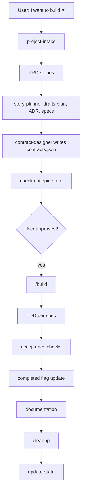

# Cutiepie

Cutiepie is a personal SWE harness for Claude Code, Codex, Cursor, Copilot, Gemini, and similar agent hosts. It turns a user idea into PRD stories, story-local specs, contracts, implementation, documentation, cleanup, and memory refresh.

Cutiepie is intentionally story-scoped. It does not use a separate global feature list or global implementation plan.

## Core Contract

Active state lives here:

```text
.cutiepie/docs/
  PRD.md
  ARCHI.md
  CONFIG.md

.cutiepie/plans/story_<nnn>_<slug>/
  plan.md
  ADR.md
  contracts.json
  specs/
    spec_<nnn>_<slug>.md
```

`PRD.md` owns human stories. Each story folder owns its own workflow, decisions, specs, and contracts. Spec frontmatter owns `completed: true/false` and acceptance-check `passes: true/false`.

## Typical Flow



## Commands

```text
/intake      classify greenfield/brownfield and personal/Heineken context
/brainstorm  create/update PRD stories, story specs, and contracts
/contracts   design or validate story contracts
/build       implement the next dependency-ready incomplete spec
/review      handle PR/code review feedback
/document    generate local or approved Heineken Confluence docs
/cleanup     remove stale/orphaned state before closeout
/preamble    manual resume context when hooks are unavailable
/update-state refresh memory and preamble
```

## Project Intake

Cutiepie detects:

- `greenfield` vs `brownfield`
- `personal` vs `heineken`
- `POC` vs `MVP`

Brownfield projects get repo review and architecture baseline. Heineken projects get Brewery / GenAI Gateway setup when relevant, Atlassian MCP setup guidance, and Confluence documentation flow with explicit user approval before publish.

Intake is adaptive: Cutiepie inspects first, then asks only unresolved decision questions such as POC vs MVP mode, whether brownfield conventions are binding, and which GenAILab/Jira targets to use for confirmed Heineken projects.

`multi-agent-adapter` normalizes Claude Code tasks, Codex workers, and inline fallback so the same story-spec task packet can run across hosts.

## Spec Frontmatter

Every story spec starts with:

```yaml
---
story_id: story_001
spec_id: spec_001
title: Login API
completed: false
depends_on: []
contracts:
  provides:
    - auth.login.response
  consumes: []
acceptance_checks:
  - id: check_001
    category: functional
    description: User can log in and receive an active session.
    steps:
      - "Step 1: Navigate to the login page."
      - "Step 2: Submit valid credentials."
      - "Step 3: Verify the dashboard loads and session is active."
    passes: false
---
```

`completed: true` is allowed only when every acceptance check in the spec has `passes: true`.

## Contracts

`contracts.json` is created after specs are drafted. It aligns providers, consumers, schemas, dependencies, and safe parallel groups.

Run:

```bash
scripts/check-cutiepie-state.sh .
```

The checker validates docs, story folders, specs, dependencies, contract references, and completion flags.

## Skill Compiler

Compile Cutiepie skills into agent-native formats:

```bash
python3 scripts/cutiepie-compile.py skills --all --output /tmp/cutiepie-skills
```

Outputs:

- Claude/Copilot: `<output>/<skill>/SKILL.md`
- Cursor: `<output>/.cursor/rules/<skill>.md`
- Codex: `<output>/AGENTS.md` with replaceable Cutiepie markers

## Verification

Useful checks:

```bash
node -e "for (const f of ['.agents/plugins/marketplace.json','package.json','.claude-plugin/plugin.json','.claude-plugin/marketplace.json','.codex-plugin/plugin.json','gemini-extension.json','.version-bump.json','hooks/hooks.json']) JSON.parse(require('fs').readFileSync(f,'utf8'))"
bash -n hooks/session-start hooks/pre-compact hooks/session-end hooks/codex-stop hooks/update-state scripts/check-cutiepie-state.sh scripts/check-cutiepie-story-state.sh scripts/sync-to-codex-plugin.sh
python3 scripts/cutiepie-compile.py skills --agent codex --output "$(mktemp -d)"
tests/cutiepie-state/test-check-cutiepie-state.sh
tests/scaffolding-repo/test-scaffold-contract.sh
tests/cutiepie-compile/test-cutiepie-compile.sh
tests/multi-agent-adapter/test-multi-agent-adapter-contract.sh
tests/story-flow/test-story-flow-contract.sh
tests/codex-plugin-sync/test-sync-to-codex-plugin.sh
```

Some checks require live agent hosts or authenticated tools. If unavailable, run static validation and document what was skipped.
