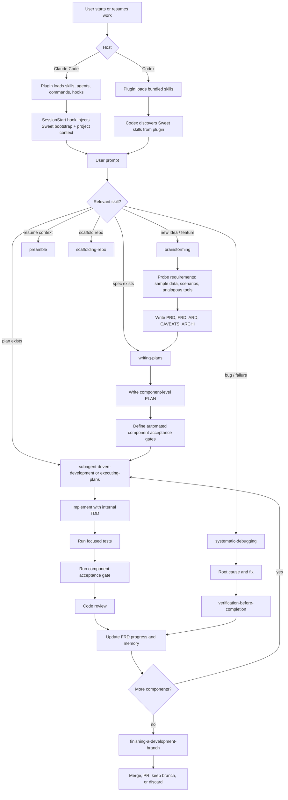
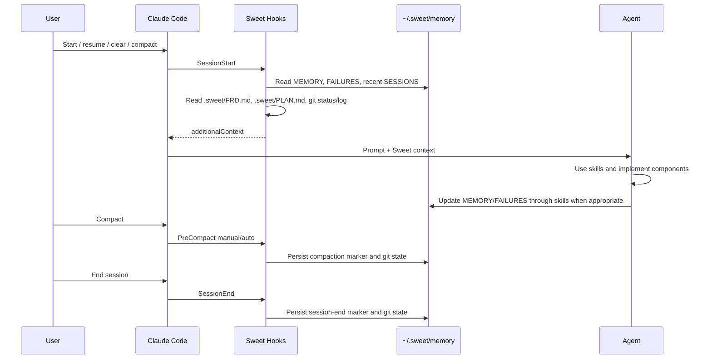

# Sweet

Sweet is an opinionated SWE harness for Claude Code and Codex. It packages reusable skills, project artifacts, component-level acceptance gates, and memory conventions so agents can move from idea to implementation with less context loss and less unit-test micromanagement.

Sweet is built around two host surfaces:

- **Claude Code:** plugin manifest, skills, agents, slash commands, and lifecycle hooks.
- **Codex:** plugin manifest, local marketplace metadata, shared skills, and Codex lifecycle hooks when `codex_hooks` is enabled.

## Core Contract

Sweet projects use these committed artifacts by default:

- `.sweet/PRD.md` — product and business requirements.
- `.sweet/FRD.md` — epics, component/capability mapping, functional requirements, and progress.
- `.sweet/ARD.md` — architecture decisions, options, and consequences.
- `.sweet/CAVEATS.md` — assumptions, dependencies, constraints, risks, and known unknowns.
- `.sweet/ARCHI.md` — C4 L1/L2 and sequence diagrams in Mermaid.
- `.sweet/PLAN.md` — component-by-component implementation plan.

`docs/sweet/` is also acceptable for repos that already keep planning docs under `docs/`. Root-level planning files are opt-in.

Runtime memory is per-user and out of tree:

```text
~/.sweet/memory/<project-slug>/
├── MEMORY.md
├── FAILURES.md
└── SESSIONS/
```

## Agentic Loop



## Hook Lifecycle

Sweet has host-specific hook adapters. Claude Code and Codex both support lifecycle hooks, but the event names and configuration locations differ.



Current hook files:

- `hooks/session-start` — injects Sweet bootstrap, memory, recent sessions, FRD/PLAN/CAVEATS snippets, and git state.
- `hooks/pre-compact` — records compaction marker, raw hook payload, branch, and git status.
- `hooks/session-end` — records session-end marker, raw hook payload, branch, and git status.
- `hooks/codex-stop` — records Codex turn-stop markers, raw hook payload, branch, and git status.

Host configuration:

- Claude Code reads `.claude-plugin/plugin.json` and `hooks/hooks.json`.
- Codex reads hooks from active config layers such as `.codex/hooks.json` or `~/.codex/hooks.json`. Project-local Codex hooks require the `.codex/` layer to be trusted.

Codex hooks are behind a feature flag:

```toml
[features]
codex_hooks = true
```

Sweet currently wires Codex `SessionStart` to `hooks/session-start` and Codex `Stop` to `hooks/codex-stop`. Use the `preamble` and `capturing-failure-modes` skills explicitly when you want a curated handoff summary rather than raw hook persistence.

## Component Acceptance Gates

Each FRD epic/component must have an automated gate. Acceptable forms:

- DTO or data-contract checks across system/domain boundaries.
- API or CLI scenario tests.
- Automated e2e/user-flow tests through Playwright, browser automation, computer-use tooling, or equivalent project harnesses.

Unit TDD remains internal to implementation. Component completion is proven by the automated acceptance gate plus review.

## Claude Code Setup

For local plugin development:

```bash
claude --plugin-dir /Users/OHM02/Repos/sweet
```

After edits:

```text
/reload-plugins
```

For local marketplace installation:

```text
/plugin marketplace add /Users/OHM02/Repos/sweet
/plugin install sweet@sweet-dev
```

Restart Claude Code after installation.

## Codex Setup

Codex supports plugins. Sweet includes `.codex-plugin/plugin.json` and a local marketplace at `.agents/plugins/marketplace.json`.

```bash
codex plugin marketplace add /Users/OHM02/Repos/sweet
```

Restart Codex, open:

```text
/plugins
```

Choose `Sweet Local`, install `Sweet`, then start a new thread. You can invoke skills explicitly with `@sweet` or by asking for the workflow by name.

For direct skill development without plugin installation:

```bash
mkdir -p ~/.agents/skills
ln -sfn /Users/OHM02/Repos/sweet/skills ~/.agents/skills/sweet
```

For subagent workflows in Codex, enable multi-agent support in `~/.codex/config.toml`:

```toml
[features]
multi_agent = true
codex_hooks = true
```

## Starting Work

New repo:

```text
Use Sweet to scaffold this repo.
```

New feature:

```text
Use Sweet to brainstorm and plan this feature.
```

Resume after a cleared or compacted session:

```text
Use the preamble skill to generate my session context.
```

Capture lessons before stopping:

```text
Use the capturing-failure-modes skill before we end this session.
```

## Verification

Useful checks:

```bash
node -e "for (const f of ['.agents/plugins/marketplace.json','package.json','.claude-plugin/plugin.json','.claude-plugin/marketplace.json','.codex-plugin/plugin.json','gemini-extension.json','.version-bump.json','hooks/hooks.json']) JSON.parse(require('fs').readFileSync(f,'utf8'))"
bash -n hooks/session-start hooks/pre-compact hooks/session-end scripts/sync-to-codex-plugin.sh
tests/skill-triggering/run-all.sh
tests/codex-plugin-sync/test-sync-to-codex-plugin.sh
```

Some checks require Claude Code, Codex, GitHub CLI, or network access. If unavailable, run static validation and document what was skipped.

## License

MIT.
