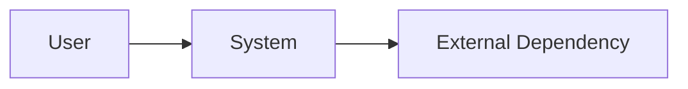
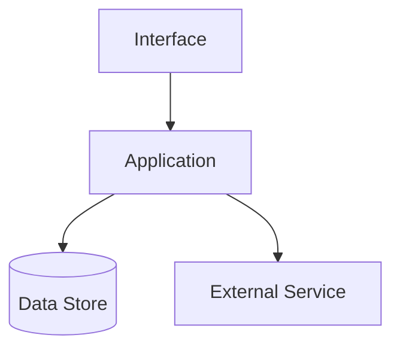
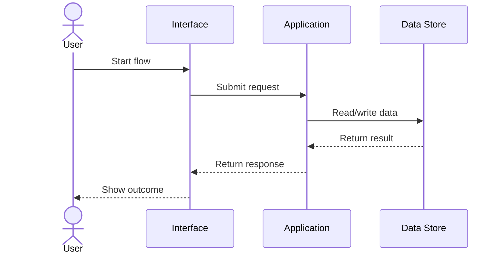

# Architecture

## C4 L1: System Context

```mermaid
flowchart LR
    User[User] --> System[System]
    System --> External[External Dependency]
```

## C4 L2: Containers

```mermaid
flowchart TB
    UI[Interface] --> App[Application]
    App --> Store[(Data Store)]
    App --> External[External Service]
```

## Sequence: Primary Flow

```mermaid
sequenceDiagram
    actor User
    participant UI as Interface
    participant App as Application
    participant Store as Data Store
    User->>UI: Start flow
    UI->>App: Submit request
    App->>Store: Read/write data
    Store-->>App: Return result
    App-->>UI: Return response
    UI-->>User: Show outcome
```
