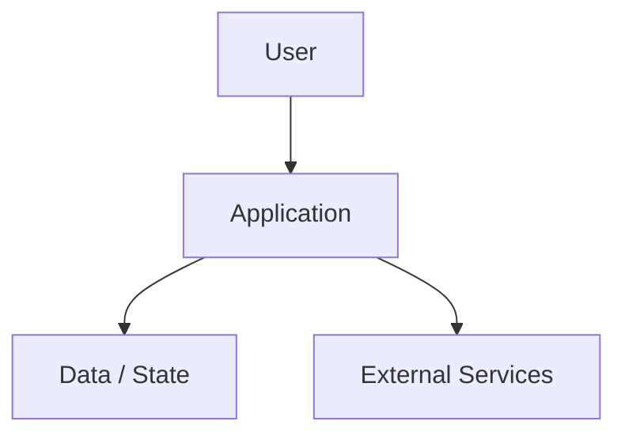

# Project Architecture

## Components

| Component | Responsibility | Inputs | Outputs |
| --- | --- | --- | --- |
| Application | Primary user/system workflow. | User request. | User-visible result. |
| Data / State | Stores or retrieves project state. | Application data. | Persisted or computed state. |
| External Services | Third-party APIs, model providers, auth, storage, or integrations. | API requests. | API responses. |

## Diagram Notes

Use a high-level layer/dataflow diagram first. Add C4 L1/L2 or sequence diagrams only when the project has enough actors, containers, or critical flows to justify them.
