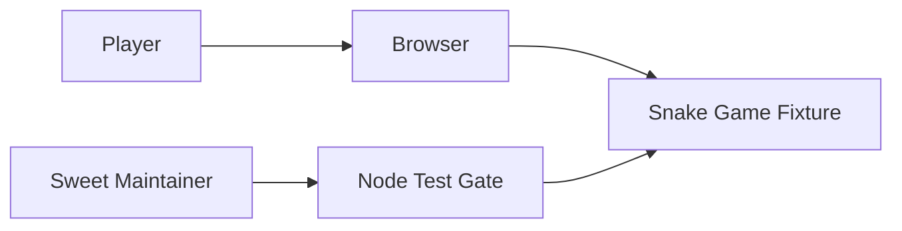
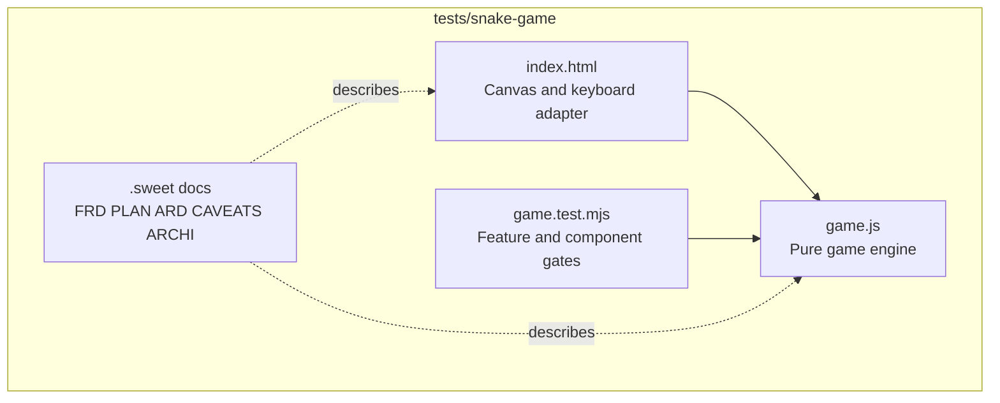
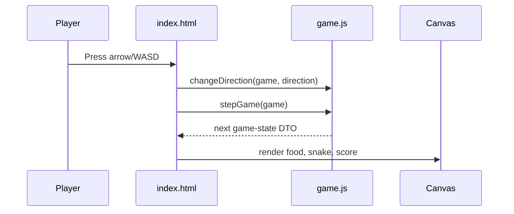
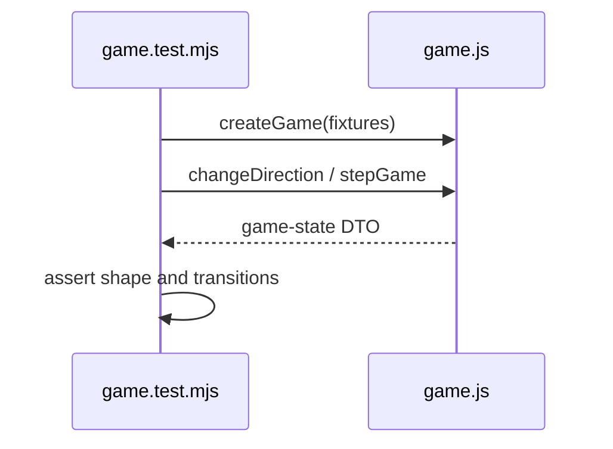

# Snake Game Architecture

## C4 L1: System Context

```mermaid
flowchart LR
    Player[Player] --> Browser[Browser]
    Browser --> Snake[Snake Game Fixture]
    Maintainer[Sweet Maintainer] --> Tests[Node Test Gate]
    Tests --> Snake
```

## C4 L2: Containers

```mermaid
flowchart TD
    subgraph Fixture[tests/snake-game]
        UI[index.html<br/>Canvas and keyboard adapter]
        Engine[game.js<br/>Pure game engine]
        Tests[game.test.mjs<br/>Feature and component gates]
        Docs[.sweet docs<br/>FRD PLAN ARD CAVEATS ARCHI]
    end

    UI --> Engine
    Tests --> Engine
    Docs -.describes.-> UI
    Docs -.describes.-> Engine
```

## Sequence: Gameplay Tick

```mermaid
sequenceDiagram
    participant Player
    participant UI as index.html
    participant Engine as game.js
    participant Canvas

    Player->>UI: Press arrow/WASD
    UI->>Engine: changeDirection(game, direction)
    UI->>Engine: stepGame(game)
    Engine-->>UI: next game-state DTO
    UI->>Canvas: render food, snake, score
```

## Sequence: Automated Gate

```mermaid
sequenceDiagram
    participant Test as game.test.mjs
    participant Engine as game.js

    Test->>Engine: createGame(fixtures)
    Test->>Engine: changeDirection / stepGame
    Engine-->>Test: game-state DTO
    Test->>Test: assert shape and transitions
```
